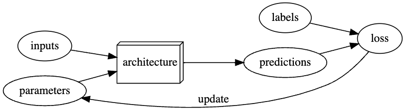

## General

**(AI(ML(DL)))** - Venn Diagram.

- ML is mainly classic algorithms and statistics.
- DL involves the use of neural networks (inspired by the human brain). DL is great at learning complex patterns in large data sets.

Even though most recent breakthroughs have been with DL, classic ML can be superior sometimes.

Limitations to ML & DL:

- models cannot be created without data
-

A difference between generating a prediction and a recommended action.

Feedbacks loops!

(training set(validation set))
training data is fully exposed, the validation data is less exposed, and test data is totally hidden. The discipline of the test set helps us keep ourselves intellectually honest.

Easy to create a model that creates predictions on the exact data it has been trained on. Harder to make accurate predictions on data it has never seen before.

Academics love to argue about different architectues, but the choice is rarely super important in practice. Archs with more layers are more prone to overfitting.

Metric is for humans, loss is for the models.

Rule of thumb when dealing with images:
if the human eye can recognize categories from the images, then a deep learning model should be able to do so too.

## Words

- Inference
  Process of using a ML model to make predictions or decisions.

- RLHF
  Reinforcement Learning with Human Feedback.

- LLM
  Large language model. GPT-3 is a LLM that uses RLHF in it's training. It is also using neural nets. LLMs do not have to use RLHF.

- CNN
  A convolutional neural network (CNN) is a type of artificial neural network specifically designed for working with data that has a grid-like structure, such as an image

- Architecture
  The "functional form" of the model.

- Model
  The combination of the architecture with a particular set of parameters

- Parameters
  The values in the model that change what task it can do, and are updated through model training

- Fit/Train
  Update the parameters of the model such that the predictions of the model using the input data match the target labels

- the Loss
  The measure of performance.

- Classification
  A classification model attempts to predict a class/category

- Regression
  A regression model attempts to predict one or more numeric quantities. Regression != Lin. Regression.

- Overfitting
  When the model starts memorizing the training set. Will happen if you train for too long without enough data.

- Transfer learning
  Using a pretrained model for a task different to what it was originally trained for.

- Fine tuning
  The process of taking an existing model and tune it for a more specific task. A transfer learning technique.

- Validation set
  A set of data held out from training, used only for measuring how good the model is

- Extrapolation
  The process of estimating a value outside of the range of known data by extending the trend of the existing data.

- Interpolation
  the process of estimating a value within the range of known data by fitting a mathematical function to the data.

### Questions

## Misc

