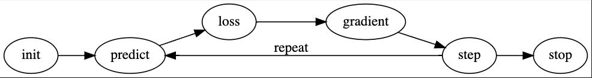

## General

What does it really mean to "stack" tensors?

How would you calculate how similar a particular image is to each of our ideal digits?

By formulating a loss function that measures the difference between the particular image and the "ideal" digit?

How to measure distance:

- Take the mean of the absolute value of differences. This is called the mean absolute difference or L1 norm.
- Take the mean of the square of differences. This is called the root mean squared error (RMSE) or L2 norm.

Intuitively, the difference between L1 norm and mean squared error (MSE) is that the latter will penalize bigger mistakes more heavily than the former (and be more lenient with small mistakes).

if we have `x = [1, 2, 3]` then the L1 norm is `|1| + |2| + |3| = 6` and the L2 norm is `sqrt(1^2 + 2^2 + 3^2) = sqrt(14) = 3.74`.

As these examples illustrate, the L1 norm is sensitive to the individual values of the vector's components, while the L2 norm is sensitive to the magnitude of the vector's components.

Pytorch tensors > NumPy arrays because numpy does not support using the GPU or calculating gradients.

The seven steps of training a deep learning model (with ours as an example):

1. Initialize the weights.
2. For each image, use these weights to predict whether it appears to be a 3 or a 7.
3. Based on these predictions, calculate how good the model is (its loss).
4. Calculate the gradient, which measures for each weight, how changing that weight would change the loss
5. Step (that is, change) all the weights based on that calculation.
6. Go back to the step 2, and repeat the process.
7. Iterate until you decide to stop the training process (for instance, because the model is good enough or you don't want to wait any longer).

**What is the difference between the cost and the loss?**
The loss function quantifies how much a model's prediction deviates from the truth for one particular object. The cost function measures the model’s error on a group of objects. To some, the cost and the loss are the same, but some authors make this clear distinction. So, the cost can be computed as the mean loss.

To calculate the gradients we call `backward` on the `loss`. This `loss` was calculated by `mse`, which took the `predictions` as an input, and the `predictions` were calculated using `f` taking `params` as an input. `params` was the object we originally called `required_grad_` on.

So we can see that they are all connected in a way. This chain of function calls represents the mathematical composition of functions, which enables PyTorch to use calculus's chain rule under the hood to calculate these gradients.

y = wx + b where w are the weights and b are the biases

CONTINUE FROM "The MNIST Loss Function" in chapter 4

## Words

- Tensor
  A mathematical concept that generalizes the notion of scalars, vectors, and matrices to higher dimensions. The rank is the number of axes or dimensions in a tensor, the shape is the size of each axis in a tensor.

- Backpropagation
  The name given to the process of calculating the derivative of each layer.

- Learning rate
  What you multiply the gradient with to change parameters of the model.

### Questions

